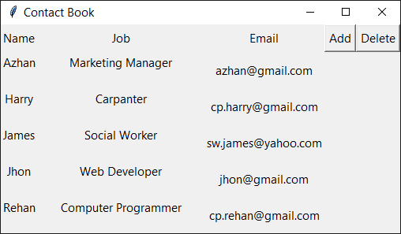
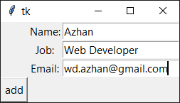
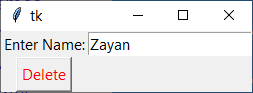

# Contact Book
Screenshots :

contact details:  
 
adding contact:  
 
deleting contact:  
 
This Project Will Create File The file name will be the contact name 
The Data Will Be Stored Like This:
"
Name
Job
Email
"
The Module Needed: 
1)Tkinter 
2)OS Opreting System
